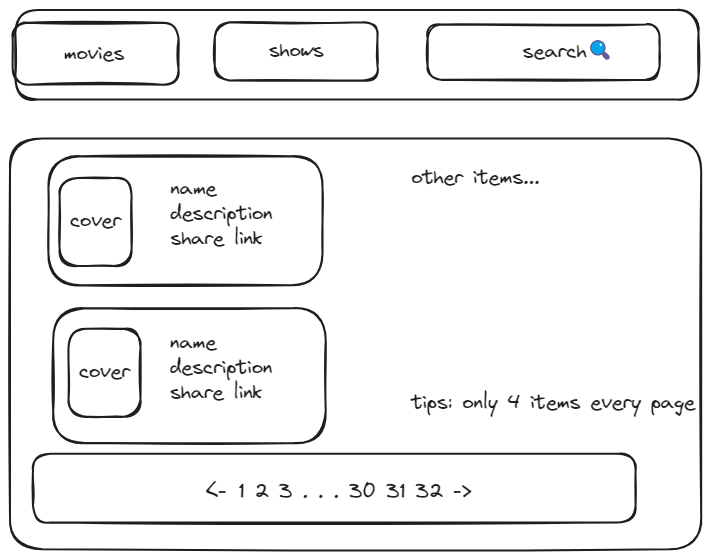

# trakt
trakt is a tool for trakt.tv, it can auto update your movie/episode watch history from trakt.tv, and save your movie/episode aliyunpan's download url to turso database, and you can deploy it to vercel.com
# Introduction
> [!IMPORTANT]
> 
> - 该项目为**Trakt**的中文扩展,数据来源于[TMDB](https://www.themoviedb.org/)和[Trakt](https://trakt.tv/)
> - 保留观看记录和电影/剧集分享链接来源,这样阿里云盘可以直接删除已观看的电影/剧集来节省空间,也确保了观看记录和分享链接依然存在,方便检索和恢复
## Features
> [!NOTE]
>
> -  自动更新(每天0点)电影/剧集观看记录
> -  记录电影/剧集阿里云盘地址(可后续变更)
> -  数据保存到[Turso](https://turso.tech/)
> -  可视化页面展示,可部署到[vercel](https://vercel.com/nichuanfangs-projects),通过nichuanfang/api项目交互保存的数据

### 原型图

